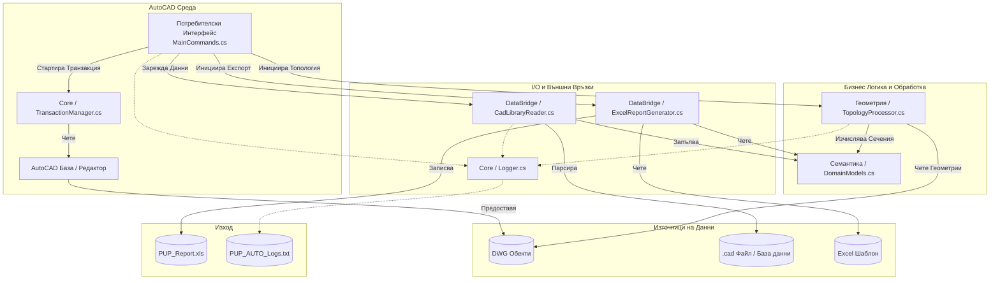

# PUP_AUTO: Архитектурен План на Системата

## 1. Общ Преглед на Системата

**PUP_AUTO** е модулен C# плъгин за Autodesk AutoCAD, предназначен да автоматизира генерирането на отчети (кадастрални баланси) за сервитути и съоръжения (стълбове). Системата извлича пространствени данни от DWG геометрии, съпоставя ги с външни кадастрални семантични данни, извършва пространствен топологичен анализ (сечения и причисляване по доминираща площ) и извежда детайлно форматиран Excel (.xls) отчет на няколко листа.

Архитектурата е изградена върху принципа за **Разделяне на отговорностите (Separation of Concerns)**, гарантирайки, че взаимодействието с CAD средата, бизнес логиката, геометричните изчисления и входно/изходните операции (I/O) са напълно независими едни от други.

## 2. Диаграма на Архитектурата

## 3. Компонентна Архитектура

### 3.1. Слой "Потребителски Интерфейс" (UI)
- **`UI.MainCommands`**: Регистрира командата `PUP_GENERATE`. Действа като оркестратор на системата (Controller). Управлява последователния работен процес: подканване на потребителя за избор, делегиране на задачи към подмодулите, обединяване на резултатите и стартиране на финалния експорт.

### 3.2. Слой "Ядро" (Core)
- **`Core.TransactionManager`**: Опакова жизнения цикъл на транзакциите в AutoCAD API. Абстрахира стандартния код за избор от потребителя, филтриране на валидни обекти (затворени `LWPOLYLINE`) и безопасно четене (`ForRead`). Също така извлича идентификаторите на обектите от `XData` или прибягва до Handle при липса на такива.
- **`Core.Logger`**: Централизиран механизъм за логване (със защита от грешки при писане), който извежда събития с времеви печат (`SUCCESS`, `WARNING` и `ERROR`) в локален текстов файл, осигурявайки непрекъсната работа дори при грешки в I/O.

### 3.3. Слой "Геометрична Обработка" (Geometry)
- **`Geometry.TopologyProcessor`**: Пространственият двигател. Конвертира полилинии в AutoCAD `Region` обекти в паметта, за да извършва прецизни булеви операции (`BoolIntersect`).
  - **Сечения на Сервитути (Servitude Intersections)**: Изчислява площта на припокриване между границата на сервитута и отделните имоти, като премахва микроскопични отрязъци под зададен праг (`SliverTolerance`).
  - **Причисляване на Стълбове (Pole Assignment)**: Реализира алгоритъм за "Доминираща площ", който причислява физическите стълбове към имота, с който се пресичат най-много, като също така засича летяща (непричислена) геометрия.

### 3.4. Семантичен (Домейн) Слой
- **`Semantics.DomainModels`**: Съдържа POCO класове, представляващи бизнес домейна: `ParcelData`, `Servitude`, `Pole` и обобщения `ReportRow`.
  - Капсулира бизнес логика като конвертиране на мерни единици в реално време (от квадратни метри в декари) и налагане на прецизност (закръгляне до 3 знака след запетаята).

### 3.5. Слой "Мост за Данни" (DataBridge)
- **`DataBridge.CadLibraryReader`**: Отговаря за извличането на външни семантични данни (от `.cad` файлове). Разполага със здрав парсер, който се справя с липсващи колони (съвместимост с по-стари формати на файловете) и различни видове разделители (запетая, табулация и др.).
- **`DataBridge.ExcelReportGenerator`**: Използва библиотеката `NPOI` за взаимодействие с Excel, без да изисква инсталиран Microsoft Office.
  - **Инжектиране в Шаблон**: Отваря предварително дефиниран `.xls` шаблон, клонира стиловете на редовете и динамично измества долната част (футъри/подписи) надолу, за да побере променлив брой редове с данни.
  - **Динамично Групиране**: Използва LINQ за агрегиране на данни по време на изпълнение (по Категория, Вид територия, Начин на трайно ползване, Собственост) за листа "Баланси".

## 4. Работен Поток (Процесът 'PUP_GENERATE')

1. **Инициализация**: Стартират се Logger и TransactionManager.
2. **Селекция**: Потребителят е подканен да избере граница на Сервитут, Стълбове и Имоти (като затворени полилинии).
3. **Зареждане на Данни**: Външните метаданни се изчитат от `TemplateC.cad`.
4. **Пространствен Анализ**: `TopologyProcessor` изпълнява булевите сечения между геометриите.
5. **Обединяване (Merge)**: Алгоритъмът `MergeResults` свързва пространствените данни (сечения, принадлежност на стълбове) със семантичните данни. Проверява се интегритетът (напр. маркиране на имоти, налични в CAD, но липсващи в базата данни).
6. **Експорт**: Съвкупността от обекти `ReportRow` се подава на `ExcelReportGenerator`, който създава финалния отчет с три листа.

## 5. Архитектурни Съображения и Добри Практики

- **Внедряване на Зависимости (Dependency Injection / Passing)**: Услуги като `Logger` и `TransactionManager` се предават надолу към процесорите като параметри (а не като глобални Singleton инстанции), което подобрява възможността за тестване на системата.
- **Устойчивост на Грешки (Fault Tolerance)**:
  - `ExcelReportGenerator` прихваща изключения за заключени файлове (ако Excel файлът вече е отворен от потребителя).
  - `CadLibraryReader` използва методи за безопасно четене на колони, за да предотврати `IndexOutOfRangeException` при лошо форматирани CSV данни.
  - `TopologyProcessor` обгръща операцията `BooleanOperation` в `try/catch` блокове, за да предотврати срив на целия процес заради сложни припокриващи се геометрии.
- **Управление на Паметта**: Обектите `Region` на AutoCAD се освобождават експлицитно (`Dispose()`) в `finally` блокове, за да се предотвратят течове в неконтролираната памет в рамките на процеса на AutoCAD.
