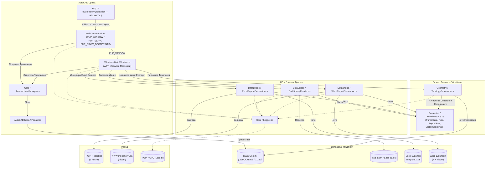

# PUP_AUTO: Архитектурен План на Системата

## 1. Общ Преглед на Системата

**PUP_AUTO** е модулен C# плъгин за Autodesk AutoCAD / Civil 3D, предназначен да автоматизира генерирането на кадастрални отчети (баланси, регистри, координатни регистри) за сервитути и съоръжения (стълбове). Системата извлича пространствени данни от DWG геометрии, съпоставя ги с външни кадастрални семантични данни, извършва пространствен топологичен анализ (сечения и причисляване по доминираща площ) и генерира детайлно форматирани **Excel (.xls)** и **Word (.docm)** отчети.

Генерирането на отчети се стартира от **графичния прозорец** (`PUP_WINDOW`), достъпен и чрез създадения при зареждане **Ribbon таб** в AutoCAD. Командата `PUP_GENERATE` (команден ред) е премахната.

Архитектурата е изградена върху принципа за **Разделяне на отговорностите (Separation of Concerns)**, гарантирайки, че взаимодействието с CAD средата, бизнес логиката, геометричните изчисления и входно/изходните операции (I/O) са напълно независими едни от други.

## 2. Диаграма на Архитектурата

## 3. Компонентна Архитектура

### 3.1. Слой "Потребителски Интерфейс" (UI)

- **`UI.App`** (`App.cs`): Входна точка на плъгина, имплементираща `IExtensionApplication`. При зареждане (`NETLOAD` / `.bundle`) се абонира за `Application.Idle`, за да създаде **Ribbon таб** "ПУП АВТОМАТИЗАЦИЯ" с бутон:
  - **"Отвори Прозорец"** → изпълнява командата `PUP_WINDOW`
  - Включва вътрешен `RibbonCommandHandler` (имплементация на `ICommand`), който маршрутизира кликванията от бутоните към AutoCAD чрез `SendStringToExecute`.

- **`UI.MainCommands`** (`MainCommands.cs`): Регистрира AutoCAD командите:
  - **`PUP_SERV`** и **`PUP_DRAW_FOOTPRINTS`**: диагностични/чертожни команди (сегментиране на сервитут; чертане на стъпките на стълбовете).
  - **`PUP_WINDOW`**: Отваря WPF модален прозорец (`MainWindow`) чрез `Application.ShowModalWindow`.
  - **`MergeResultsStatic()`** (`public static`): Обединява геометричните изчисления (площи и принадлежност на стълбове) с текстовите метаданни от `.cad` базата по ключ `ParcelId`. При липса на парцел в базата, задава `Owner = "NO DATA"` и записва Warning в лога.
  - **`ResolveProjectDirectory()`** (`private static`): Намира работната директория чрез абсолютен път от `Path.GetDirectoryName(doc.Name)`, с fallback към `Environment.CurrentDirectory`.

- **`UI.Windows.MainWindow`** (`Windows/MainWindow.cs`): WPF модален прозорец, изграден изцяло в C# код (без XAML), с тъмна тема **Catppuccin Mocha**. Предоставя:
  - **Секция "Входни файлове"**: Бутони за ръчно избиране на `.cad` база и папка с шаблони.
  - **Секция "Избор на геометрии"**: 3 бутона (Сервитут / Стълбове / Имоти), които скриват прозореца, подканват потребителя в AutoCAD и показват статус (✅/❌).
  - **Секция "Генериране"**: Checkboxes за Excel (.xls), Word (.docm) и Координатни регистри.
  - **Лог конзола**: Текстов панел с реално време обратна връзка (`Consolas` шрифт).
  - **Бутон "ГЕНЕРИРАЙ ОТЧЕТИ"**: Изпълнява целия pipeline (зареждане → топология → обединяване → Excel → координати → Word) с GUI feedback.
  - Поддържа персистираща транзакция (`_activeTransaction`) между отделните pick операции и я освобождава (`Abort`) при затваряне на прозореца.

### 3.2. Слой "Ядро" (Core)

- **`Core.TransactionManager`**: Опакова жизнения цикъл на транзакциите в AutoCAD API. Абстрахира стандартния код за избор от потребителя, филтриране на валидни обекти (затворени `LWPOLYLINE`) и безопасно четене (`ForRead`). Също така извлича идентификаторите на обектите от `XData` или прибягва до Handle при липса на такива.
- **`Core.Logger`**: Централизиран механизъм за логване (със защита от грешки при писане), който извежда събития с времеви печат (`SUCCESS`, `WARNING` и `ERROR`) в локален текстов файл, осигурявайки непрекъсната работа дори при грешки в I/O.

### 3.3. Слой "Геометрична Обработка" (Geometry)

- **`Geometry.TopologyProcessor`**: Пространственият двигател. Конвертира полилинии в AutoCAD `Region` обекти в паметта, за да извършва прецизни булеви операции (`BoolIntersect`).
  - **Сечения на Сервитути** (`CalculateServitudeIntersections`): Изчислява площта на припокриване между границата на сервитута и отделните имоти, като премахва микроскопични отрязъци под зададен праг (`SliverTolerance = 0.001 m²`).
  - **Причисляване на Стълбове** (`AssignPolesToParcels`): Реализира алгоритъм за "Доминираща площ", който причислява физическите стълбове към имота, с който се пресичат най-много, като също така засича летяща (непричислена) геометрия.
  - **Извличане на Координати** (`ExtractPolylineVertices`): Извлича последователните X, Y координати (върхове) от полилиния в списък от `VertexCoordinate` обекти, с опционален префикс за етикетите. Използва се за генерация на координатните регистри за стълбове и сервитут.
  - Помощни методи: `CreateRegionFromPolyline()` (създава `Region` от затворена полилиния) и `GetPolylineCentroid()` (среден център на върховете за логване).

### 3.4. Семантичен (Домейн) Слой

- **`Semantics.DomainModels`**: Съдържа POCO класове, представляващи бизнес домейна:
  - **`ParcelData`**: Кадастрални данни за имот — `ParcelId`, `Owner`, `Ekatte`, `DocumentArea`, `SubDivision`, `TerritoryType`, `Usage`, `Locality`, `Category`, `OwnershipType`, `OwnerId`, `OwnerName`.
  - **`Pole`**: Данни за стълб — `PoleId`, `PoleNumber`, `PoleAreaSqM`, `Location` (Point3d).
  - **`ReportRow`**: Обобщен ред за отчет, съдържащ всички кадастрални полета плюс:
    - `AssignedPoles` (`List<Pole>`) — списък на причислените стълбове.
    - `RemainderAreaSqM` — остатък: `max(0, DocumentAreaSqM - ServitudeAreaSqM)` в m². Преобразуването в декари става само при запис в отчета чрез `AreaUnits.SqmToDka()` (закръгляне до 3 знака).
    - `PoleNumbers` — форматиран низ, напр. `"Стълб №24,Стълб №23"`.
  - **`VertexCoordinate`**: Координати на връх от полилиния — `PointIndex`, `PointLabel`, `X`, `Y`. Използва се за координатните регистри.

### 3.5. Слой "Мост за Данни" (DataBridge)

- **`DataBridge.CadLibraryReader`**: Отговаря за извличането на външни семантични данни (от `.cad` файлове). Разполага със здрав парсер с локална функция `SafeCol(int index, string fallback = "")`, който се справя с липсващи колони (съвместимост с по-стари формати) и различни видове разделители (`,`, `;`, `\t`). Парсва 12 колони (0–11) за всеки ред.

- **`DataBridge.ExcelReportGenerator`**: Използва библиотеката **NPOI** за взаимодействие с Excel (формат `.xls` / BIFF8), без да изисква инсталиран Microsoft Office.
  - **Инжектиране в Шаблон**: Отваря `_Templates/TemplateX.xls`, клонира стиловете от реда-образец (ред 5) и динамично измества долната част (футъри/подписи) надолу чрез `ShiftRowsDown()`.
  - **Лист 0 — "Засегнати имоти"**: Попълва 15 колони (индекси 0–14) с данни за имоти.
  - **Лист 1 — "Стълбове"**: Попълва 5 колони, сортирани по `PoleNumber`, с търсене на собственик по `AssignedParcelId`.
  - **Лист 2 — "Баланси"**: `PopulateBalancesSheet()` изпълнява 4 групиращи LINQ заявки (по Категория, Вид собственост, Вид територия, НТП) с `Sum()` агрегации.

- **`DataBridge.WordReportGenerator`**: Използва **OpenXML SDK** (`DocumentFormat.OpenXml`) за генерация на Word документи от `.docm` шаблони, без MS Office.
  - **Публичен API — `GenerateAllReports()`**: Диспечира генерацията на всички регистри.
  - **Алгоритъм**: Копира шаблона, открива таблицата, извлича последния ред като template row (с `CloneNode(true)`), премахва го и клонира за всеки запис. `SetCellText()` запазва оригиналното форматиране (`RunProperties`).
  - Генерира следните 7 регистъра:

  | Шаблон | Описание | Статус |
  |---|---|---|
  | `D306-31Y0-02` | Регистър на засегнатите имоти (14 колони) | ✅ Имплементиран |
  | `D306-31Y0-03` | Регистър на стъпките на стълбове (9 колони + ред с тотали) | ✅ Имплементиран |
  | `D306-31Y0-04` | Баланси територията (4 групирани подтаблици, 9 колони) | ✅ Имплементиран |
  | `D306-31Y0-05` | Общ Баланс за общината (9 колони, групиране по землище) | ✅ Имплементиран |
  | `D306-31Y0-06` | Обща рекапитулация (7 колони, групиране по вид територия) | ✅ Имплементиран |
  | `D306-31Y0-07` | Координатен регистър на стъпките на стълбовете | ✅ Имплементиран |
  | `D306-31Y0-08` | Координатен регистър на сервитута | ✅ Имплементиран |

## 4. Работен Поток

### 4.1. Процесът 'PUP_WINDOW' (Графичен Прозорец)

1. **Инициализация**: Стартират се Logger, TransactionManager и TopologyProcessor.
2. **Селекция**: Потребителят избира геометриите чрез бутони в GUI — Сервитут, Стълбове и Имоти (прозорецът се скрива по време на селекция).
3. **Зареждане на Данни**: Външните метаданни се изчитат от избрания регистър (по подразбиране `TemplateC.cad`).
4. **Пространствен Анализ**: `TopologyProcessor` изпълнява булевите сечения и причисляване на стълбове.
5. **Обединяване (Merge)**: `MergeResultsStatic()` свързва пространствените данни със семантичните данни по `ParcelId`. Маркира имоти с `"NO DATA"`, ако липсват в базата.
6. **Excel Експорт**: `ExcelReportGenerator` създава `PUP_Report.xls` с три листа.

Допълнителни възможности:
- Може да избере кои отчети да генерира (Excel / Word / Координатни регистри) чрез checkboxes.
- **Стъпка 3b — Извличане на координати**: `ExtractPolylineVertices()` извлича координати за стълбове и сервитут.
- **Стъпка 5 — Word Експорт**: `WordReportGenerator.GenerateAllReports()` създава до 7 Word регистъра.
- Целият прогрес се показва в реално време в лог конзолата на GUI.

## 5. Архитектурни Съображения и Добри Практики

- **Внедряване на Зависимости (Dependency Injection / Passing)**: Услуги като `Logger` и `TransactionManager` се предават надолу към процесорите като параметри (а не като глобални Singleton инстанции), което подобрява възможността за тестване на системата.
- **Устойчивост на Грешки (Fault Tolerance)**:
  - `ExcelReportGenerator` прихваща изключения за заключени файлове (ако Excel файлът вече е отворен от потребителя).
  - `CadLibraryReader` използва методи за безопасно четене на колони, за да предотврати `IndexOutOfRangeException` при лошо форматирани CSV данни.
  - `TopologyProcessor` обгръща операцията `BooleanOperation` в `try/catch` блокове, за да предотврати срив на целия процес заради сложни припокриващи се геометрии.
- **Управление на Паметта**: Обектите `Region` на AutoCAD се освобождават експлицитно (`Dispose()`) в `finally` блокове, за да се предотвратят течове в неконтролираната памет в рамките на процеса на AutoCAD.
- **Двоен Изход**: Системата генерира едновременно Excel (.xls чрез NPOI) и Word (.docm чрез OpenXML SDK) отчети, използвайки изцяло template-based подход.
