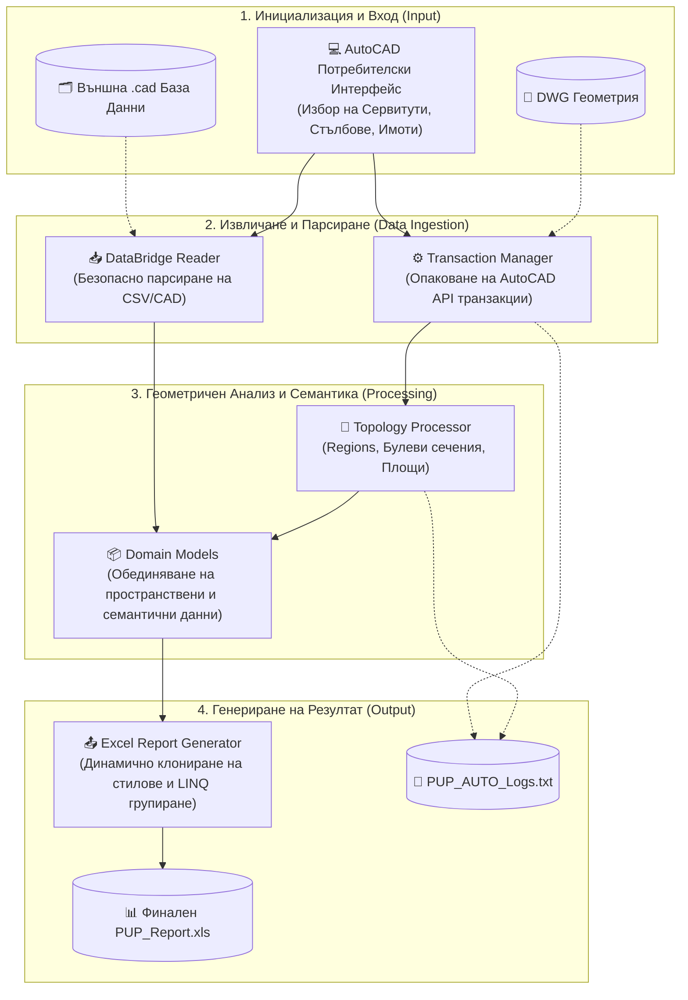

# 🏗️ PUP_AUTO_V0.1

<div align="center">
  
  
  
  
</div>

<br/>

**PUP_AUTO** е специализиран плъгин за Autodesk AutoCAD, създаден с цел пълна автоматизация при изготвянето на кадастрални баланси и отчети за засегнати имоти. Софтуерът драстично оптимизира работния процес на инженерите, като автоматично изчислява площи на припокриване между сервитути, стълбове и имоти, интегрирайки ги с външни бази данни.

---

## 🎯 Ключови Функционалности

* **Пространствена Топология:** Високопрецизно булево пресичане (Boolean Intersect) на затворени полилинии, гарантиращо точно изчисляване на площите в квадратни метри и автоматичното им конвертиране в декари.
* **Smart Pole Assignment:** Интелигентен алгоритъм за автоматично причисляване на инфраструктурни обекти (стълбове) към имотите, с които имат най-голямо сечение на припокриване.
* **Data Integration:** Вграден четец за външни `.cad` файлове, който обогатява геометрията със семантични данни (собственик, вид територия, НТП, категория).
* **Готови Excel Отчети:** Експорт към професионално форматиран, многолистов `.xls` файл (чрез библиотеката NPOI), включващ динамични обобщения и запазени места за подписи.

---

## 🗺️ Системна Архитектура и Работен Процес

Архитектурата на системата е изградена модулно (Separation of Concerns) и проследява ясен, стъпков процес от извличането на данните до техния експорт.



### 📋 Подробно описание на стъпките (прозорец `PUP_WINDOW`, бутон "ГЕНЕРИРАЙ ОТЧЕТИ"):
1. **Инициализация:** Потребителят отваря прозореца с командата `PUP_WINDOW` (или с бутона "Отвори Прозорец" в Ribbon таба).
2. **Селекция:** С бутоните "Сервитут", "Стълбове" и "Имоти" се избират геометриите в чертежа. `SelectionService` безопасно чете техните XData атрибути.
3. **Парсиране на базата:** `DataBridge Reader` зарежда метаданните за имотите от файла `TemplateC.cad`, като се справя с евентуални липсващи колони чрез fallback логика.
4. **Пространствен Анализ:** `TopologyProcessor` конвертира полилиниите в Regions и изчислява точното сечение между сервитут и имот, като елиминира микроскопични артефакти от изчертаването. Извършва се и анализът за причисляване на стълбовете.
5. **Обединяване (Merge):** Данните от чертежа се свързват с тези от базата. Ако даден имот отсъства в `.cad` файла, се маркира с "NO DATA" и се записва предупреждение (Warning).
6. **Експорт:** `ExcelReportGenerator` клонира ред-шаблон от `TemplateX.xls` и автоматично генерира 3 листа с данни: "Засегнати имоти", "Стълбове" и обобщени "Баланси".

---

## 🚀 Инсталация и Стартиране

1. **Клониране и Компилация**
   Клонирайте хранилището и компилирайте проекта чрез .NET CLI:
   ```bash
   dotnet build
   ```

2. **Подготовка на Данни**
   В папката на вашия работен `.dwg` чертеж, създайте следните подпапки:
   * `_TestFiles/` - поставете тук вашата база данни (`TemplateC.cad`)
   * `_Templates/` - поставете тук Excel шаблона (`TemplateX.xls`)

3. **Зареждане в AutoCAD**
   * Отворете AutoCAD.
   * Напишете `NETLOAD` и изберете компилирания `PUP_AUTO.dll`.

4. **Генериране на Отчет**
   * Напишете командата `PUP_WINDOW` в AutoCAD (или натиснете "Отвори Прозорец" в Ribbon таба).
   * Изберете сервитута, стълбовете и имотите с бутоните в прозореца и натиснете "ГЕНЕРИРАЙ ОТЧЕТИ".
   * Проверете генерирания отчет и лог файла в работната директория.

---

> [!CAUTION]
> Следете лог файла `PUP_AUTO_Logs.txt` за предупреждения (Warnings) при генерирането. Системата засича автоматично липсващи имоти във външната база данни или стълбове, начертани извън селектираните граници ("floating geometry").
