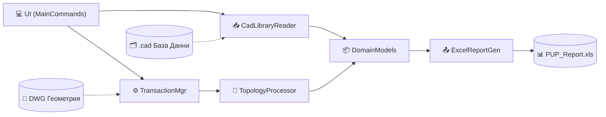

# 🏗️ PUP_AUTO_V0.1

<div align="center">
  
  
  
</div>

<br/>

**PUP_AUTO** е модулен C# плъгин за Autodesk AutoCAD. Основната му цел е автоматизирането на сложни пространствени изчисления и генерирането на прецизни кадастрални баланси и отчети за засегнати имоти (сервитути и стълбове). Системата извлича пространствени данни от DWG геометрии, съпоставя ги с външни семантични данни и експортира подробен Excel отчет.

---

## 🎯 Основни Функционалности

* **Пространствен Анализ:** Автоматизирано булево пресичане (Boolean Intersect) между сервитути, стълбове и имоти.
* **Доминираща Площ (Dominant Area Assignment):** Интелигентен алгоритъм за причисляване на стълбове към имота, с който имат най-голямо сечение.
* **Външни Бази Данни:** Надежден четец (DataBridge) на `.cad` файлове с устойчивост при липсващи или неформатирани данни.
* **Автоматични Excel Отчети:** Експорт към многолистов `.xls` файл, запазващ форматиране, формули и подписи, използвайки NPOI.

---

## 🗺️ Архитектура

Архитектурата е изградена на принципа за **Разделяне на отговорностите (Separation of Concerns)**. Данните протичат линейно, осигурявайки лесна поддръжка и устойчивост на грешки.



---

## 🚀 Инсталация и Стартиране

1. **Клониране и Компилация**
   Клонирайте хранилището и компилирайте проекта чрез .NET CLI:
   ```bash
   dotnet build
   ```

2. **Подготовка на Данни**
   В папката на вашия работен `.dwg` чертеж, създайте следните подпапки:
   * `_TestFiles/` - поставете тук вашата база данни (`TemplateC.cad`)
   * `_Templates/` - поставете тук Excel шаблона (`TemplateX.xls`)

3. **Зареждане в AutoCAD**
   * Отворете AutoCAD.
   * Напишете `NETLOAD` и изберете компилирания `PUP_AUTO.dll` (намиращ се в `bin/Debug` или `bin/Release`).

4. **Генериране на Отчет**
   * Напишете командата `PUP_GENERATE` в AutoCAD.
   * Следвайте инструкциите за избор на полилинии (Сервитут -> Стълбове -> Имоти).
   * Готовият Excel отчет (`PUP_Report.xls`) и лог файлът (`PUP_AUTO_Logs.txt`) ще бъдат генерирани в папката на чертежа.

---

## 🛠️ Използвани Технологии

* **Език:** C#
* **Среда:** .NET / AutoCAD .NET API
* **Библиотеки:** 
  * `Autodesk.AutoCAD.Runtime` (за интеграция с AutoCAD)
  * `NPOI` (за генериране на Excel файлове без изискване за MS Office)

---

> [!CAUTION]
> Следете лог файла `PUP_AUTO_Logs.txt` за предупреждения (Warnings) при генерирането. Системата засича автоматично липсващи имоти в `.cad` файла или стълбове извън селектираните граници ("floating geometry").
