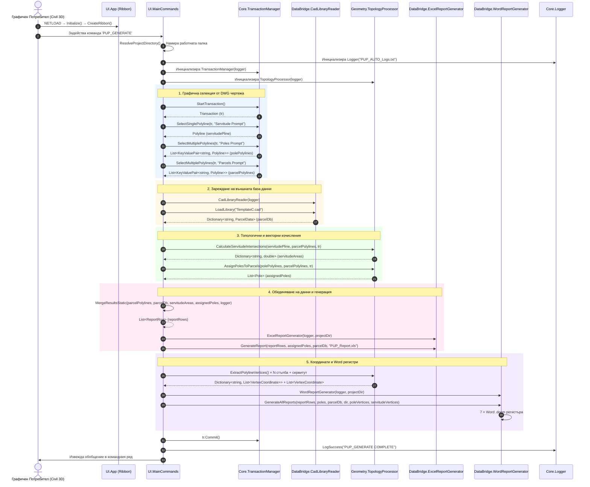

# 📘 ТЕХНИЧЕСКА ДОКУМЕНТАЦИЯ И ПАСПОРТ НА СОФТУЕРА PUP_AUTO

---

## 1. 📌 ОБЩА АРХИТЕКТУРА И КОНЦЕПЦИЯ

Софтуерният пакет **PUP_AUTO** е специализиран .NET модул (плагин) за **Autodesk Civil 3D** и **AutoCAD**, разработен на C# (.NET Framework 4.8). Неговата основна цел е автоматизация на пространствения анализ, топологичното пресичане и генерацията на ведомости за засегнати имоти при изготвяне на Подробни Устройствени Планове (ПУП) за линейни обекти (електропроводи, водопроводи, газопроводи и пътна инфраструктура).

Системата генерира два типа изходни документи: **Excel (.xls)** отчет с 3 работни листа и **7 Word (.docm)** регистъра, включително координатни регистри.

### Разделение на отговорностите (Separation of Concerns):
Архитектурата е организирана в 5 строго изолирани слоя (Layers), гарантиращи висока модулност, лесна поддръжка и възможност за самостоятелно модулно тестване:

1. **`Core` (Определящ и системен слой):**
   - Управлява взаимодействията с базата данни на AutoCAD DWG чертежа, транзакциите (`TransactionManager`) и логването на системни събития и грешки (`Logger`).
   - Гарантира термична памет и безупречно управление на CAD ресурсите.

2. **`Semantics` (Домейнов слой):**
   - Съдържа чисто домейнови бизнес модели (`ParcelData`, `Servitude`, `Pole`, `ReportRow`, `VertexCoordinate`).
   - Независим от AutoCAD API интерфейсите, капсулира математиката за преобразуване на мерни единици (от квадратни метри $m^2$ в декари $\text{дка}$).

3. **`DataBridge` (Интеграционен слой за данни):**
   - **Входен мост (`CadLibraryReader`):** Парсва външни текстови бази данни (`TemplateC.cad`), съдържащи кадастрални регистрови данни.
   - **Изходен мост — Excel (`ExcelReportGenerator`):** Обвива NPOI библиотеката за работа с Excel шаблони (`TemplateX.xls`), извършва динамично вмъкване на редове и агрегиране на данни.
   - **Изходен мост — Word (`WordReportGenerator`):** Използва OpenXML SDK (`DocumentFormat.OpenXml`) за генерация на 7 Word (.docm) регистъра от шаблони, без да изисква инсталиран Microsoft Office.

4. **`Geometry` (Топологичен и пространствен слой):**
   - `TopologyProcessor` съдържа векторните алгоритми за пресичане на площи, създаване на 2D `Region` обекти, прилагане на булеви операции, определяне на доминираща площ при припокриване на стълбове с имоти и извличане на координати от полилинии.

5. **`UI` (Потребителски и команден слой):**
   - `App` е входната точка на плагина (`IExtensionApplication`), създаваща Ribbon таб "ПУП АВТОМАТИЗАЦИЯ" с два бутона.
   - `MainCommands` регистрира двете AutoCAD команди: `PUP_GENERATE` (CLI) и `PUP_WINDOW` (GUI).
   - `MainWindow` е WPF модален прозорец с тъмна Catppuccin Mocha тема, предоставящ визуален интерфейс за избор на геометрии, файлове и опции за генериране.

### Интеграция с Autodesk Civil 3D / Map 3D API:
Софтуерът стъпва директно върху управляваните сглобки (Managed Assemblies) на Autodesk:
- `Autodesk.AutoCAD.ApplicationServices`
- `Autodesk.AutoCAD.DatabaseServices`
- `Autodesk.AutoCAD.EditorInput`
- `Autodesk.AutoCAD.Geometry`

Това гарантира съвместимост както със стандартен AutoCAD, така и с надградените платформи Civil 3D и Map 3D, като използва родната транзакционна система на AutoCAD Database за четене на затворени полилинии (`LWPOLYLINE` / `Polyline`) и техните DXF разширени данни (`XData`).

### Преглед на потока на данните (Data Flow Overview):
1. **Вход 1 (Чертеж):** Потребителят избира сервитутна полилиния, полилинии на стълбове и кадастрални имоти от DWG чертежа.
2. **Вход 2 (Външен файл):** Чете се текстов файл `TemplateC.cad` с кадастралните собственици, категории, начини на трайно ползване (НТП) и видове собственост.
3. **Обработка:** `TopologyProcessor` пресича геометричните контури и пресмята площи. `MergeResultsStatic` свързва графичните Handle/XData идентификатори с текстовите регистри. `ExtractPolylineVertices` извлича координати.
4. **Изход:** Генерира се Excel доклад (`PUP_Report.xls`) с 3 работни листа, 7 Word регистъра (.docm) и текстов лог файл (`PUP_AUTO_Logs.txt`).

---

## 2. 🔄 ПЪЛЕН ЖИЗНЕН ЦИКЪЛ (Execution Trace)

### 2.1. Зареждане на плагина (Plugin Load)
При `NETLOAD` на `PUP_AUTO.dll`, AutoCAD изпълнява:
1. `App.Initialize()` → абонира се за `Application.Idle`.
2. `OnAppIdle()` → еднократно създава Ribbon таб "ПУП АВТОМАТИЗАЦИЯ" с два бутона:
   - "Генерирай Отчети" → `PUP_GENERATE`
   - "Отвори Прозорец" → `PUP_WINDOW`

### 2.2. Процес 'PUP_GENERATE' (Команден Ред)

При въвеждане на командата `PUP_GENERATE` в командния ред на Civil 3D, системата преминава през следната строга хронологична последователност:



### 2.3. Процес 'PUP_WINDOW' (Графичен Прозорец)

Извършва същите стъпки, но чрез WPF модален прозорец (`MainWindow`):
1. Потребителят избира геометрии чрез бутони в GUI (прозорецът се скрива по време на селекция в AutoCAD).
2. Потребителят избира кои отчети да генерира чрез checkboxes (Excel / Word / Координатни регистри).
3. Целият прогрес се показва в реално време в лог конзолата на прозореца.
4. Поддържа персистираща транзакция (`_activeTransaction`) между отделните pick операции.

---

## 3. ⚙️ ПОДРОБЕН РАЗБОР НА ВСЯКА ФУНКЦИЯ ПО КЛАСОВЕ

---

### 📁 UI Layer

#### 📄 `UI/App.cs`
Входна точка на плагина, имплементираща `IExtensionApplication`.

1. **`public void Initialize()`**
   - **Логика:** Абонира се за `Application.Idle += OnAppIdle`, за да отложи създаването на Ribbon таба до пълното зареждане на AutoCAD.
2. **`private void OnAppIdle(object sender, EventArgs e)`**
   - **Логика:** Извиква се еднократно, незабавно се отписва от `Application.Idle`, след което извиква `CreateRibbon()`.
3. **`private void CreateRibbon()`**
   - **Логика:** Създава нов Ribbon Tab "ПУП АВТОМАТИЗАЦИЯ" с панел, съдържащ два `RibbonButton`:
     - "Генерирай Отчети" → `PUP_GENERATE`
     - "Отвори Прозорец" → `PUP_WINDOW`
4. **`class RibbonCommandHandler : ICommand`**
   - **Логика:** Маршрутизира кликвания от Ribbon бутоните към AutoCAD чрез `doc.SendStringToExecute(commandName, ...)`.

---

#### 📄 `UI/MainCommands.cs`
Регистрира AutoCAD командите и оркестрира целия pipeline.

1. **`[CommandMethod("PUP_GENERATE")] public void PupGenerate()`**
   - **Сигнатура:** `() -> void`
   - **Логика:** Изпълнява последователно стъпки 1 до 6 от жизнения цикъл (селекция → зареждане → топология → обединяване → Excel → координати → Word → обобщение). Обхванат от глобален `try-catch` за безопасно логване на непокрити грешки.
2. **`[CommandMethod("PUP_WINDOW")] public void PupWindow()`**
   - **Сигнатура:** `() -> void`
   - **Логика:** Създава инстанция на `MainWindow` и я показва модално чрез `Application.ShowModalWindow(window)`.
3. **`public static List<ReportRow> MergeResultsStatic(...)`**
   - **Сигнатура:** `(List<KeyValuePair<string, Polyline>> parcelPolylines, Dictionary<string, ParcelData> parcelDb, Dictionary<string, double> servitudeAreas, List<Pole> assignedPoles, Logger logger) -> List<ReportRow>`
   - **Логика:** Обединява данните от геометрията и текста. За имоти от чертежа, които липсват в `.cad` файла, задава `Owner = "NO DATA"` и записва Warning в лога. **Публичен статичен метод**, споделен между CLI и GUI входните точки.
4. **`private static string ResolveProjectDirectory()`**
   - **Сигнатура:** `() -> string`
   - **Логика:** Извлича папката на текущия чертеж от `Path.GetDirectoryName(doc.Name)` (абсолютен път) или използва `Environment.CurrentDirectory` като fallback.

---

#### 📄 `UI/Windows/MainWindow.cs`
WPF модален прозорец, изграден изцяло в C# код (без XAML), с тъмна тема **Catppuccin Mocha**.

1. **`public MainWindow()`**
   - **Логика:** Извиква `BuildUI()` за конструиране на WPF контролите и `ResolveDefaults()` за автоматично разпознаване на `.cad` файл и `_Templates` папка.
2. **`private void BuildUI()`**
   - **Логика:** Конструира 6-редов Grid layout:
     - Ред 0: Заглавие "⚡ ПУП АВТОМАТИЗАЦИЯ"
     - Ред 1: Полета за `.cad` база и шаблони с Browse бутони
     - Ред 2: 3 бутона за избор на геометрии (Сервитут / Стълбове / Имоти)
     - Ред 3: Checkboxes (Excel / Word / Координатни регистри)
     - Ред 4: Лог конзола (`Consolas` шрифт)
     - Ред 5: Бутон "🚀 ГЕНЕРИРАЙ ОТЧЕТИ"
3. **`private void PickFromAutoCAD(Action pickAction)`**
   - **Логика:** Скрива прозореца (`this.Hide()`), изпълнява pick действието в AutoCAD, след което показва прозореца (`this.Show()`). Обхванат от `try-catch-finally`.
4. **`private void EnsureTransaction()`**
   - **Логика:** Lazy-инициализира `Logger`, `TransactionManager` и `Transaction` ако не съществуват или са disposed. Поддържа персистираща транзакция между pick операциите.
5. **`private void BtnGenerate_Click(object sender, RoutedEventArgs e)`**
   - **Логика:** Валидира, че всички геометрии са избрани. Изпълнява 7-стъпков pipeline (Load CAD → Topology → Merge → Coordinates → Excel → Word → Commit). Извежда прогрес в лог конзолата.
6. **`protected override void OnClosed(EventArgs e)`**
   - **Логика:** Abort-ва и Dispose-ва активната транзакция при затваряне на прозореца.

---

### 📁 Core Layer

#### 📄 `Core/TransactionManager.cs`
Управлява жизнения цикъл на транзакциите в DWG базата данни и събирането на обекти от чертежа.

1. **`public TransactionManager(Logger logger)`**
   - **Сигнатура:** `(Logger logger) -> void`
   - **Логика:** Приема и инжектира логер съобщението в локално поле `_logger`.
2. **`public Document GetActiveDocument()`**
   - **Сигнатура:** `() -> Document`
   - **Логика:** Връща референция към текущия активен документ `Application.DocumentManager.MdiActiveDocument`.
3. **`public Editor GetEditor()`**
   - **Сигнатура:** `() -> Editor`
   - **Логика:** Връща редактора за интеракция с потребителя `GetActiveDocument().Editor`.
4. **`public Database GetDatabase()`**
   - **Сигнатура:** `() -> Database`
   - **Логика:** Връща структурата от данни на чертежа `GetActiveDocument().Database`.
5. **`public Transaction StartTransaction()`**
   - **Сигнатура:** `() -> Transaction`
   - **Логика:** Стартира нова транзакция чрез `GetDatabase().TransactionManager.StartTransaction()`.
6. **`public Polyline? SelectSinglePolyline(Transaction transaction, string promptMessage)`**
   - **Сигнатура:** `(Transaction transaction, string promptMessage) -> Polyline?`
   - **Логика:** Задава `PromptEntityOptions` с филтър за тип `Polyline`. Подканва потребителя за единичен избор. Проверява дали обектът е валидна и затворена полилиния (`pline.Closed`). Ако е отворена или селекцията е отменена, логва Warning и връща `null`.
7. **`public List<KeyValuePair<string, Polyline>> SelectMultiplePolylines(Transaction transaction, string promptMessage)`**
   - **Сигнатура:** `(Transaction transaction, string promptMessage) -> List<KeyValuePair<string, Polyline>>`
   - **Логика:** Прилага `SelectionFilter` с DXF код `LWPOLYLINE`. Прихваща множество обекти. Обхожда селекцията, пропуска незатворените полилинии. Проверява `XData` за ASCII низ с идентификатор (ParcelId / PoleId). Ако липсва, като идентификатор ползва геометричния `Handle` на обекта.

---

#### 📄 `Core/Logger.cs`
Предоставя fault-tolerant (защитена от сривове) лог система.

1. **`public Logger(string logFilePath = "PUP_AUTO_Logs.txt")`**
   - **Сигнатура:** `(string logFilePath) -> void`
   - **Логика:** Запазва пътя. Извлича папката с `Path.GetDirectoryName`. Ако папка съществува и липсва на диска, извиква `Directory.CreateDirectory`.
2. **`public void LogSuccess(string message)`**
   - **Логика:** Извиква `WriteLog("SUCCESS", message)`.
3. **`public void LogError(string message)`**
   - **Логика:** Извиква `WriteLog("ERROR", message)`.
4. **`public void LogWarning(string message)`**
   - **Логика:** Извиква `WriteLog("WARNING", message)`.
5. **`private void WriteLog(string level, string message)`**
   - **Логика:** Форматира времеви маркер: `yyyy-MM-dd HH:mm:ss [LEVEL] Message\r\n`. Използва `File.AppendAllText`. Прихваща всички изключения с празен `catch` блок, за да гарантира, че проблем със записването на диска няма да спре изпълнението на AutoCAD.

---

### 📁 Semantics Layer

#### 📄 `Semantics/DomainModels.cs`
Дефинира структурата на данните и преобразуването на мерни единици.

1. **`class ParcelData`**
   - Полета за имот: `ParcelId`, `Owner`, `Ekatte`, `DocumentArea` ($m^2$), `ObjectId`.
   - Регистрови полета: `SubDivision`, `TerritoryType`, `Usage`, `Locality`, `Category`, `OwnershipType`, `OwnerId`, `OwnerName`.
2. **`class Servitude`**
   - Полета: `ServitudeId`, `AssignedParcelId`, `Area` ($m^2$), `ObjectId`.
3. **`class Pole`**
   - Полета: `PoleId`, `AssignedParcelId`, `PoleNumber`, `PoleAreaSqM` ($m^2$), `Location` (`Point3d`), `ObjectId`.
   - **Преобразуване в декари (Property Getter):**
     $$\text{PoleAreaDecares} \implies \text{Math.Round}(\text{PoleAreaSqM} / 1000.0, 3)$$
4. **`class ReportRow`**
   - Съдържа пълния набор от данни за ред в отчетите.
   - **Преобразувания в декари (Property Getters):**
     $$\text{DocumentAreaDecares} \implies \text{Math.Round}(\text{DocumentAreaSqM} / 1000.0, 3)$$
     $$\text{ServitudeAreaDecares} \implies \text{Math.Round}(\text{ServitudeAreaSqM} / 1000.0, 3)$$
     $$\text{PoleAreaDecares} \implies \text{Math.Round}(\text{PoleAreaSqM} / 1000.0, 3)$$
   - **Допълнителни изчислими свойства:**
     - `AssignedPoles` (`List<Pole>`) — списък на причислените стълбове към имота.
     - `RemainderAreaDecares` — остатъчна площ: `Math.Round(DocumentAreaDecares - ServitudeAreaDecares, 3)`.
     - `PoleNumbers` — форматиран низ от номера: `"Стълб №24,Стълб №23"` (сортиран по `PoleNumber`).
5. **`class VertexCoordinate`**
   - Полета: `PointIndex`, `PointLabel` (string), `X` (double), `Y` (double).
   - Използва се за координатните регистри (Word шаблони 07 и 08).

---

### 📁 DataBridge Layer

#### 📄 `DataBridge/CadLibraryReader.cs`
Парсва текстовия регистър от външни среди.

1. **`public CadLibraryReader(Logger logger)`**
   - **Логика:** Инжектира `Logger`.
2. **`public Dictionary<string, ParcelData> LoadLibrary(string fileName)`**
   - **Сигнатура:** `(string fileName) -> Dictionary<string, ParcelData>`
   - **Логика:** Проверява съществуването на файла. Прочита редовете с `File.ReadAllLines`. Разделя всеки ред по символи `,`, `;`, `\t`.
   - **Защитна функция (Safe Parsing):**
     Дефинира локалната функция `SafeCol(int index, string fallback = "")`, която връща почистения низ или `fallback`, ако колоната липсва в по-стари версии на `.cad` файла. Парсва 12 колони (индекси 0–11).
   - Преобразува площта чрез `double.TryParse`. Добавя валидните редове в речника с ключ `ParcelId`.

---

#### 📄 `DataBridge/ExcelReportGenerator.cs`
Попълва Excel файл от шаблон `TemplateX.xls` с помощта на NPOI.

1. **`public ExcelReportGenerator(Logger logger, string projectDirectory)`**
   - **Логика:** Дефинира абсолютен път до шаблона: `Path.Combine(projectDirectory, "_Templates", "TemplateX.xls")`.
2. **`public void GenerateReport(List<ReportRow> data, List<Pole> poles, Dictionary<string, ParcelData> parcelDb, string outputFilePath)`**
   - **Логика:** Зарежда `HSSFWorkbook` от потока на шаблона. Зарежда последователно трите работни листа:
     - Sheet 0: `"Засегнати имоти"` (попълва 15 колони, индекси 0–14).
     - Sheet 1: `"Стълбове"` (сортира по `PoleNumber`, търси собственик по `AssignedParcelId`).
     - Sheet 2: `"Баланси"` (извиква `PopulateBalancesSheet`).
     Записва изходния файл.
3. **`private void PopulateSheet(ISheet sheet, int startRowIndex, int rowCount, Action<IRow, IRow, int> writeAction)`**
   - **Логика:** Взема примерния ред (за преписване на стила). Извиква `ShiftRowsDown` за изместване на формулите и футера надолу, след което изписва данните реда по ред.
4. **`private void PopulateBalancesSheet(IWorkbook workbook, ISheet sheet, List<ReportRow> data)`**
   - **Логика:** Изпълнява 4 групиращи LINQ заявки (по `Category`, `OwnershipType`, `TerritoryType`, `Usage`). За всяко групиране измества съдържанието надолу, изписва заглавие, заглавни колони и LINQ сумираните редове (`Sum(DocumentAreaDecares)`, `Sum(ServitudeAreaDecares)`, `Sum(PoleCount)`, `Sum(PoleAreaDecares)`).
5. **`private void ShiftRowsDown(ISheet sheet, int firstRowIndex, int count)`**
   - **Логика:** Използва `sheet.ShiftRows(firstRowIndex, sheet.LastRowNum, count, copyRowHeight: true, resetOriginalRowHeight: false)`.
6. **`private void SetCell(...)` (Overloads)**
   - **Логика:** Задава типа на клетката (`CellType.String` / `CellType.Numeric`), вписва стойността и прилага шаблония стил.

---

#### 📄 `DataBridge/WordReportGenerator.cs`
Генерира Word (.docm) регистри от шаблони чрез OpenXML SDK.

1. **`public WordReportGenerator(Logger logger, string projectDirectory)`**
   - **Логика:** Инжектира `Logger` и задава пътя до `_Templates` папката.
2. **`public void GenerateAllReports(...)`**
   - **Сигнатура:** `(List<ReportRow> reportRows, List<Pole> assignedPoles, Dictionary<string, ParcelData> parcelDb, string outputDir, string settlementName, string ekatte, string municipality, string oblast, Dictionary<string, List<VertexCoordinate>>? poleVertices, List<VertexCoordinate>? servitudeVertices) -> void`
   - **Логика:** Диспечира генерацията на всички 7 регистъра последователно.
3. **`private void GenerateParcelRegister(List<ReportRow> data, string outputDir)`**
   - **Шаблон:** `D306-31Y0-02` — Регистър на засегнатите имоти (14 колони).
   - **Логика:** Клонира template row, попълва 14 колони с данни за всеки засегнат имот.
4. **`private void GeneratePoleStepsRegister(List<Pole> poles, Dictionary<string, ParcelData> parcelDb, List<ReportRow> reportRows, string outputDir)`**
   - **Шаблон:** `D306-31Y0-03` — Регистър на стъпките на стълбове (9 колони + ред с тотали).
   - **Логика:** Сортира по `PoleNumber`, включва ред с тотали.
5. **`private void GenerateBalancesTerritory(List<ReportRow> data, string outputDir)`**
   - **Шаблон:** `D306-31Y0-04` — Баланси територията (4 групирани подтаблици, 9 колони).
   - **Логика:** Работи с 4 таблици в шаблона. Групира данните по Category, OwnershipType, TerritoryType, Usage. Всяка група включва тотали и процентно разпределение.
6. **`private void GenerateBalancesMunicipality(List<ReportRow> data, Dictionary<string, ParcelData> parcelDb, string outputDir, ...)`**
   - **Шаблон:** `D306-31Y0-05` — Общ Баланс за общината (9 колони).
   - **Логика:** Групира по землище (Ekatte от `ParcelData`). Единична агрегирана таблица с тотали за всяко населено място.
7. **`private void GenerateRecapitulation(List<ReportRow> data, string outputDir)`**
   - **Шаблон:** `D306-31Y0-06` — Обща рекапитулация (7 колони).
   - **Логика:** Групира по `TerritoryType`. Включва ред с общи тотали.
8. **`private void GenerateCoordinateRegisterPoles(List<Pole> poles, Dictionary<string, List<VertexCoordinate>> poleVertices, string outputDir)`**
   - **Шаблон:** `D306-31Y0-07` — Координатен регистър на стъпките на стълбовете.
   - **Логика:** Центроид + върхови координати за всеки стълб.
9. **`private void GenerateCoordinateRegisterServitude(List<VertexCoordinate> vertices, string outputDir)`**
   - **Шаблон:** `D306-31Y0-08` — Координатен регистър на сервитута.
   - **Логика:** Последователен списък на върховите координати.
10. **`private void SetCellText(List<TableCell> cells, int index, string text)`**
    - **Логика:** Запазва оригиналните `RunProperties` (шрифт, размер, bold) от шаблона, изчиства старите `Run` елементи и вмъква нов `Run` с новия текст.

---

### 📁 Geometry Layer

#### 📄 `Geometry/TopologyProcessor.cs`
Извършва геометричните анализи с AutoCAD `Region` обекти.

1. **`public TopologyProcessor(Logger logger)`**
   - **Сигнатура:** `(Logger logger) -> void`
2. **`public Dictionary<string, double> CalculateServitudeIntersections(Polyline servitudePline, List<KeyValuePair<string, Polyline>> parcelPolylines, Transaction transaction)`**
   - **Логика:** Преобразува сервитута в `Region`. За всеки имот създава `parcelRegion`, клонира сервитутния регион и изпълнява `intersectRegion.BooleanOperation(BooleanOperationType.BoolIntersect, parcelRegion)`. Записва площта, ако е по-голяма от `SliverTolerance` ($0.001 m^2$).
3. **`public List<Pole> AssignPolesToParcels(List<KeyValuePair<string, Polyline>> polePolylines, List<KeyValuePair<string, Polyline>> parcelPolylines, Transaction transaction)`**
   - **Логика:** Прилага алгоритъма за доминираща площ. Намира имота с максимално пресичане с контура на стълба. При липса на сечение логва Warning с Handle и X,Y координатите на центроида.
4. **`public List<VertexCoordinate> ExtractPolylineVertices(Polyline pline, string labelPrefix = "")`**
   - **Сигнатура:** `(Polyline pline, string labelPrefix) -> List<VertexCoordinate>`
   - **Логика:** Обхожда всички върхове на полилинията (от `0` до `pline.NumberOfVertices`), извлича X и Y координатите, генерира етикети с опционален префикс (напр. `"23-1"`, `"23-2"`). Връща списък от `VertexCoordinate` обекти. Използва се за координатните регистри (шаблони 07 и 08).
5. **`private Region? CreateRegionFromPolyline(Polyline pline)`**
   - **Логика:** Завърта полилинията в `DBObjectCollection` и извиква `Region.CreateFromCurves`. Връща първия генериран регион и освобождава останалите.
6. **`private Point3d GetPolylineCentroid(Polyline pline)`**
   - **Логика:** Изчислява усреднения център на върховете на полилинията.

---

## 4. 🧮 КЛЮЧОВИ АЛГОРИТМИ И МАТЕМАТИКА

### 1️⃣ Алгоритъм "Dominant Area Assignment" (Присвояване по доминираща площ)

При стълбове, разположени на имотни граници, техният геометричен контур пресича повече от един имот.

```
       Имот 101                 Имот 102
+-----------------------+-----------------------+
|                       |                       |
|                 +-----+-----+                 |
|                 |  A1 |  A2 |                 |  <- Стълб (Pole)
|                 |     |     |                 |
|                 +-----+-----+                 |
|                       |                       |
+-----------------------+-----------------------+
```

#### Математически модел:
1. За контур на стълб $P$ и имот $K_i$ се изчислява площта на застъпване:
   $$A_{\text{int}}(i) = \text{Area}(\text{Region}(P) \cap \text{Region}(K_i))$$
2. **Филтриране на микро-сечения (Slivers):**
   $$\text{Ако } A_{\text{int}}(i) \le 0.001 \text{ m}^2 \implies \text{сечението се отхвърля.}$$
3. **Критерий за избор:**
   $$\text{AssignedParcelId} = \arg\max_{K_i} \left( A_{\text{int}}(i) \right)$$
   Стълбът се зачислява **единствено** към имота, с който има най-голяма площ на припокриване.

---

### 2️⃣ Алгоритъм "Dynamic Template Row Insertion" (Динамично вмъкване в Excel)

За да не се нарушат формулите и форматирането във футера на шаблона `TemplateX.xls`:

1. Извлича се стилът от реда-образец `startRowIndex = 5`.
2. За $N$ броя редове с данни се изчисляват нужните нови редове $\Delta R = N - 1$.
3. Изпълнява се NPOI ShiftRows:
   ```csharp
   sheet.ShiftRows(startRowIndex + 1, sheet.LastRowNum, rowsToInsert, copyRowHeight: true, resetOriginalRowHeight: false);
   ```
4. Всички формули във футера (напр. `=SUM(...)`) автоматично актуализират своя обхват без загуба на референции.

---

### 3️⃣ Алгоритъм "Word Template Row Cloning" (Клониране на шаблонни редове в Word)

За генерация на Word регистрите, системата прилага следния подход:

1. Копира `.docm` шаблона в изходната папка.
2. Отваря документа с `WordprocessingDocument.Open(path, true)`.
3. Намира таблицата и извлича последния ред като template row чрез `CloneNode(true)`.
4. Премахва template row от таблицата.
5. За всеки запис клонира template row и попълва клетките чрез `SetCellText()`.
6. `SetCellText()` запазва оригиналните `RunProperties` (шрифт, размер, bold, italic) от шаблона, гарантирайки консистентно форматиране.

---

## 5. 📊 ТРАНСФОРМАЦИЯ НА ДАННИТЕ (Data Pipeline Diagram)

```
[DWG Polyline Handle: "A2F"] (Графика)         [TemplateC.cad String] (Текст)
       │                                               │
       ▼                                               ▼
+------------------------------------+  +------------------------------------+
| TransactionManager                 |  | CadLibraryReader                   |
| SelectMultiplePolylines()          |  | LoadLibrary()                      |
| Извлича: KeyValuePair<string,Poly> |  | SafeCol(), double.TryParse()       |
+------------------------------------+  +------------------------------------+
       │                                               │
       │  (ParcelId: "68134.501.123")                  │  (ParcelId: "68134.501.123")
       ▼                                               ▼
+----------------------------------------------------------------------------+
| TopologyProcessor & Geometry Engine                                        |
| 1. CalculateServitudeIntersections() -> ServitudeAreaSqM = 450.25 m²       |
| 2. AssignPolesToParcels()            -> PoleAreaSqM = 12.50 m², Count = 1 |
| 3. ExtractPolylineVertices()         -> List<VertexCoordinate>             |
+----------------------------------------------------------------------------+
                                       │
                                       ▼
+----------------------------------------------------------------------------+
| MainCommands.MergeResultsStatic()   (public static)                        |
| Напасване по ParcelId:                                                      |
|  - Взема кадастралните полета от ParcelData (или "NO DATA" ако липсва)     |
|  - Обединява графично изчислените площи в m²                               |
+----------------------------------------------------------------------------+
                                       │
                                       ▼
+----------------------------------------------------------------------------+
| Semantics.ReportRow (Domain Object)                                        |
|  - DocumentAreaSqM  = 12500.0 m²  ──► DocumentAreaDecares  = 12.500 дка     |
|  - ServitudeAreaSqM =   450.25 m² ──► ServitudeAreaDecares =  0.450 дка     |
|  - PoleAreaSqM      =    12.50 m² ──► PoleAreaDecares      =  0.013 дка     |
|  - RemainderAreaDecares = 12.500 - 0.450 = 12.050 дка                      |
|  - AssignedPoles: [Pole{...}]     ──► PoleNumbers = "Стълб №24"            |
+----------------------------------------------------------------------------+
                                       │
                          ┌────────────┴────────────┐
                          ▼                          ▼
+-------------------------------+  +-------------------------------+
| ExcelReportGenerator          |  | WordReportGenerator           |
| "Засегнати имоти" (15 col)    |  | D306-31Y0-02 → 08            |
| "Стълбове" (5 col)            |  | 7 × .docm регистъра          |
| "Баланси" (4× LINQ groups)   |  | CloneNode + SetCellText      |
+-------------------------------+  +-------------------------------+
              │                                │
              ▼                                ▼
    📄 PUP_Report.xls            📄 7 × Word (.docm) регистри
                    📝 PUP_AUTO_Logs.txt
```

---

## 6. 🛠️ РЪКОВОДСТВО ЗА ПОТРЕБИТЕЛЯ

### 1. Компилиране на проекта:
Отворете командния ред (Terminal) в коренната папка на проекта и изпълнете:
```bash
dotnet build PUP_AUTO.slnx --configuration Release
```
Или компилирайте през Visual Studio (`Build Solution`). Генерираният DLL файл ще се намира в `bin/Release/net48/PUP_AUTO.dll`.

### 2. Зареждане в Autodesk Civil 3D / AutoCAD:
1. Стартирайте Civil 3D.
2. Отворете целевия DWG чертеж.
3. Въведете командата `NETLOAD` в командния ред.
4. Навигирайте и изберете компилирания файл `PUP_AUTO.dll`.
5. Ribbon табът **"ПУП АВТОМАТИЗАЦИЯ"** ще се появи автоматично с два бутона.

### 3. Настройка на тестови папки и шаблони:
Уверете се, че в папката на DWG чертежа съществуват следните поддиректории:
- `_TestFiles/TemplateC.cad` — Текстовият файл с кадастралния регистър.
- `_Templates/` — Папка с шаблонни файлове:
  - `TemplateX.xls` — Excel шаблон с редове-образци и формули.
  - `D306-31Y0-02-0A - Регистър на засегнатите имоти.docm`
  - `D306-31Y0-03-0A - Регистър на стъпките на стълбове.docm`
  - `D306-31Y0-04-0A - Баланси територията.docm`
  - `D306-31Y0-05-0A - Общ Баланс за общината.docm`
  - `D306-31Y0-06-0A - Обща рекапитулация.docm`
  - `D306-31Y0-07-0A - Координатен регистър на стъпките на стълбовете.docm`
  - `D306-31Y0-08-0A - Координатен регистър на сервитута.docm`

### 4. Изпълнение на командите:

#### Вариант А: Команден ред (PUP_GENERATE)
1. Напишете `PUP_GENERATE` в командния ред и натиснете `Enter`.
2. Изберете полилинията на сервитута.
3. Изберете полилиниите на стълбовете (натиснете `Enter` за потвърждение).
4. Изберете полилиниите на имотите (натиснете `Enter` за потвърждение).
5. Системата автоматично генерира всички Excel и Word отчети.

#### Вариант Б: Графичен прозорец (PUP_WINDOW)
1. Напишете `PUP_WINDOW` в командния ред (или натиснете бутона "Отвори Прозорец" от Ribbon таба).
2. Проверете/променете пътищата до `.cad` базата и папката с шаблони.
3. Изберете геометриите чрез трите бутона (Сервитут / Стълбове / Имоти).
4. Включете/изключете желаните изходи чрез checkboxes.
5. Натиснете "🚀 ГЕНЕРИРАЙ ОТЧЕТИ".
6. Следете прогреса в лог конзолата.

### 5. Резултати и проверка на лог файла:
- Генерираният Excel доклад се записва като `PUP_Report.xls` в папката на чертежа.
- Word регистрите се записват в папката на чертежа с оригиналните имена на шаблоните.
- При възникнали предупреждения (липсващи данни за имоти или стълбове извън имоти), отворете файла `PUP_AUTO_Logs.txt` за подробна диагностика.
